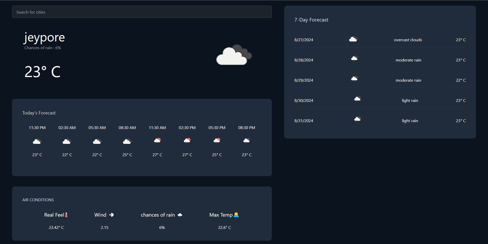
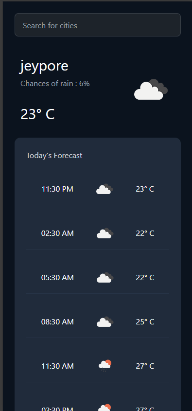

# Weather App

## Project Overview

This weather app allows users to check the current weather, a 5-day forecast, and detailed weather data for every 3-hour interval for any specific location. The app provides a user-friendly interface with error handling to ensure smooth interaction even when a user inputs invalid locations. The app is responsive, functioning seamlessly across different screen sizes.

### Features:
- Display current weather for any location.
- 5-day weather forecast.
- 3-hour interval weather updates.
- Error handling for invalid locations.
- Responsive design for mobile and desktop views.

---

## Set Up and Run Locally

### Prerequisites
- Node.js (v14 or higher)
- npm (v6 or higher)
- Git

### Instructions

1. Clone the repository:

    ```bash
    git clone https://github.com/your-username/weather-app.git
    cd weather-app
    ```

2. Install the dependencies:

    ```bash
    npm install
    ```

3. Create a `.env` file in the root directory and add your OpenWeather API key:

    ```plaintext
    REACT_APP_WEATHER_API_KEY=your-api-key
    ```

4. Run the application locally:

    ```bash
    npm start
    ```

The app will be available at [http://localhost:3000](http://localhost:3000).

---

## API Usage

This app uses the [OpenWeatherMap API](https://openweathermap.org/api) to fetch weather data.

### API Endpoints
1. **Current Weather Data:**
   - **Endpoint:** `https://api.openweathermap.org/data/2.5/weather?q={city}&appid={API_KEY}`
   - **Parameters:**
     - `city`: Name of the city (e.g., "London").
     - `API_KEY`: Your personal OpenWeather API key.

2. **5-Day Weather Forecast:**
   - **Endpoint:** `https://api.openweathermap.org/data/2.5/forecast?q={city}&appid={API_KEY}`
   - Provides weather forecast data for every 3 hours.

---

## Screenshots

### Desktop View


### Mobile View


---

## Approach

The app is built using React, with state management to store weather data and error states. API calls are made using the `fetch` method, with error handling to ensure users receive feedback if an invalid location is entered.

- **Frontend**: The user interface is responsive, designed using CSS for different screen sizes.
- **State Management**: Weather data (current, 5-day, and 3-hour intervals) is stored separately for ease of access and rendering.
- **Error Handling**: The app gracefully handles invalid inputs, notifying users of any issues without crashing.
